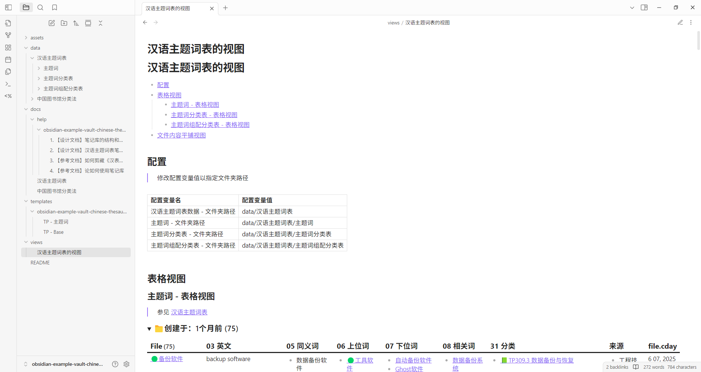
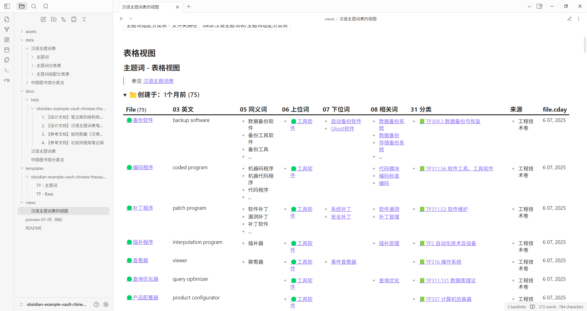
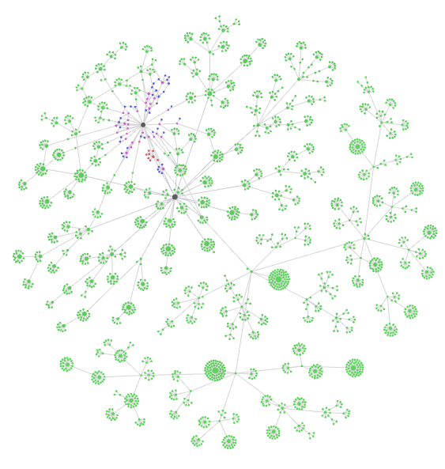

这是一个 Obisidian 示例库，用于存储和可视化显示 《汉语主题词表》 的主题词

This is an Obisidian Example Vault for storing and visualizing the subject terms of the "Chinese Thesaurus".

## 可视化页面效果

> （打开笔记 `view/汉语主题词表的视图.md` 的效果）

## 更多信息，参见如下的文档

- [1. 【设计文档】笔记库的结构和依赖](docs/help/obsidian-example-vault-chinese-thesaurus/1.%20【设计文档】笔记库的结构和依赖.md)
- [2. 【设计文档】汉语主题词表笔记的相关标准](docs/help/obsidian-example-vault-chinese-thesaurus/2.%20【设计文档】汉语主题词表笔记的相关标准.md)
- [3. 【参考文档】如何剪藏《汉表服务系统》的主题词](docs/help/obsidian-example-vault-chinese-thesaurus/3.%20【参考文档】如何剪藏《汉表服务系统》的主题词.md)
- [4. 【参考文档】论如何使用笔记库](docs/help/obsidian-example-vault-chinese-thesaurus/4.%20【参考文档】论如何使用笔记库.md)