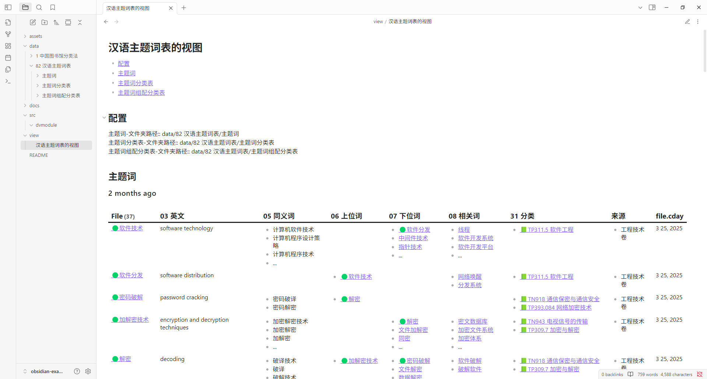

这是一个 Obisidian 示例库，用于存储和可视化显示 《汉语主题词表》 的主题词

This a Obsidian Example Vault, used for collecting and using Descriptors of "Chinese Thesaurus"

## 可视化页面效果

> （打开笔记 `view/汉语主题词表的视图.md` 的效果）

## 更多信息，参见如下的文档

- [1. 笔记库的结构](<docs/1. 笔记库的结构.md>)
- [2. 如何剪藏《汉表服务系统》的主题词](<docs/2. 如何剪藏《汉表服务系统》的主题词.md>)
- [3. 汉语主题词表笔记的相关标准](<docs/3. 汉语主题词表笔记的相关标准.md>) 
