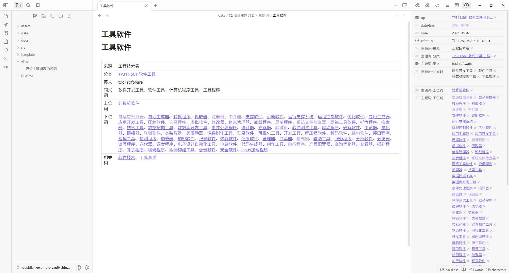
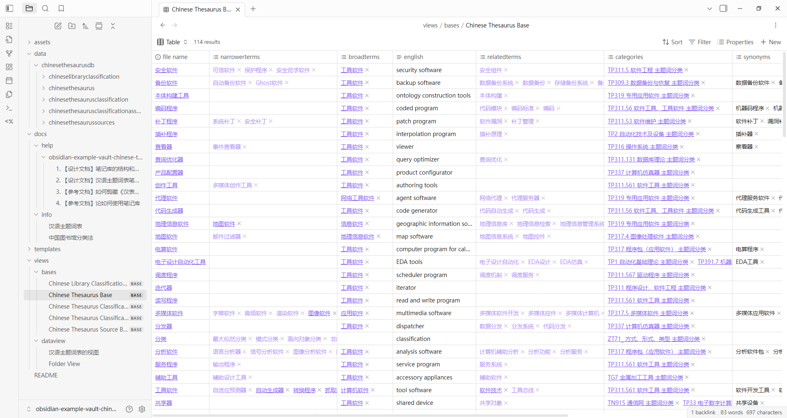
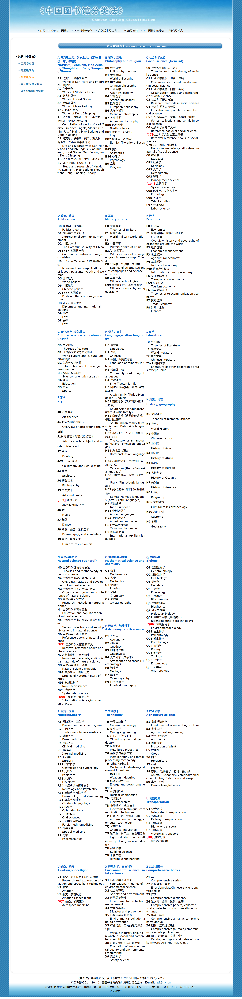

# README

这是一个 Obsidian 示例库，用于存储和可视化显示 《汉语主题词表》 的主题词

This is an Obsidian Example Vault for storing and visualizing the subject terms of the "Chinese Thesaurus".

预览： https://abc202306.github.io/website-obsidian-example-vault-chinese-thesaurus

> [!NOTE]
> 
> 1. [截图-pictures](#截图-pictures)
> 2. [笔记数据的来源](#笔记数据的来源)
> 3. [项目文档-docs](#项目文档-docs)
> 4. [集锦笔记-collection](#集锦笔记-collection)
> 5. [文件夹结构](#文件夹结构)
> 6. [窗体笔记-base](#窗体笔记-base)
> 7. [白板笔记-canvas](#白板笔记-canvas)
> 8. [中国图书馆分类法简表截图](#中国图书馆分类法简表截图)

## 截图-pictures

## 笔记数据的来源

1. 分类笔记数据的来源
	1. 《中国图书馆分类法》数据来源于Github 仓库 [acdzh/Chinese-Library-Classification: CLC, 中图法, 中国图书馆分类法](https://github.com/acdzh/Chinese-Library-Classification)
	2. 《中国图书馆分类法》附加的《ZT* 通用概念》和《ZY* 附表》数据来源于 [汉语主题词表服务系统](https://ct.istic.ac.cn/site/organize/index)
2. 主题词笔记数据的来源
	1. 《汉语主题词表》数据来源于网站 [汉语主题词表服务系统](https://ct.istic.ac.cn/site/organize/index)

## 项目文档-docs

- [1. 【设计文档】笔记库的结构和依赖](docs/1.%20【设计文档】笔记库的结构和依赖.md)
- [2. 【设计文档】汉语主题词表笔记的相关标准](docs/2.%20【设计文档】汉语主题词表笔记的相关标准.md)
- [3. 【参考文档】如何剪藏《汉表服务系统》的主题词](docs/3.%20【参考文档】如何剪藏《汉表服务系统》的主题词.md)
- [4. 【参考文档】论如何使用笔记库](docs/4.%20【参考文档】论如何使用笔记库.md)

## 集锦笔记-collection

1. [汉语主题词](collection/汉语主题词.md)
2. [中国图书馆分类法别名](collection/中国图书馆分类法别名.md)
3. [汉语主题词分类](collection/汉语主题词分类.md)
4. [汉语主题词来源](collection/汉语主题词来源.md)
5. [中国图书馆分类法](collection/中国图书馆分类法.md)

## 文件夹结构

1. `assets/`
	1. `documents/`
		1. ... (unshown subfolders)
	2. `pictures/`
		1. `clcbasescreenshots/`
		2. `clcitemcover/`
			1. ... (unshown subfolders)
		3. `clcitemicon/`
			1. ... (unshown subfolders)
		4. `clcwebsitepreview/`
		5. `ctvaultpreview/`
2. `base/`
3. `canvas/`
4. `chineselibraryclassification/`
	1. ... (unshown subfolders)
5. `chineselibraryclassificationaliases/`
	1. ... (unshown subfolders)
6. `chinesethesaurus/`
7. `chinesethesaurusclassification/`
8. `chinesethesaurussources/`
9. `collection/`
10. `docs/`
11. `lagacy/`
	1. ... (unshown subfolders)

## 窗体笔记-base

1. [Chinese Library Classification Aliase Base.base](base/Chinese%20Library%20Classification%20Aliase%20Base.base)
2. [Chinese Library Classification Base.base](base/Chinese%20Library%20Classification%20Base.base)
3. [Chinese Thesaurus Source Base.base](base/Chinese%20Thesaurus%20Source%20Base.base)
4. [Chinese Thesaurus Base.base](base/Chinese%20Thesaurus%20Base.base)
5. [Chinese Thesaurus Classification Base.base](base/Chinese%20Thesaurus%20Classification%20Base.base)

## 白板笔记-canvas

1. [中国图书馆分类法 Canvas.canvas](canvas/中国图书馆分类法%20Canvas.canvas)
2. [D 政治、法律 Canvas.canvas](canvas/D%20政治、法律%20Canvas.canvas)
3. [H 语言、文字 Canvas.canvas](canvas/H%20语言、文字%20Canvas.canvas)
4. [J2 绘画 Canvas.canvas](canvas/J2%20绘画%20Canvas.canvas)
5. [O 数理科学和化学 Canvas.canvas](canvas/O%20数理科学和化学%20Canvas.canvas)

## 中国图书馆分类法简表截图

